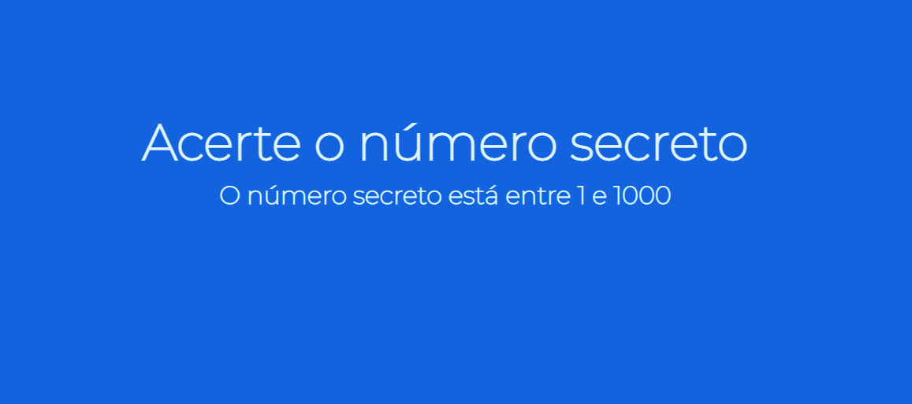
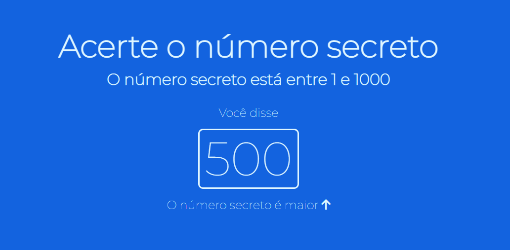
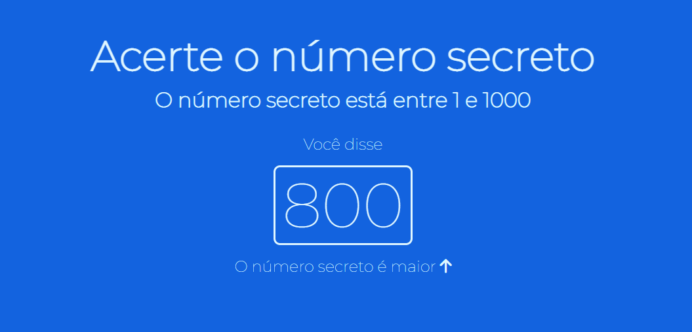
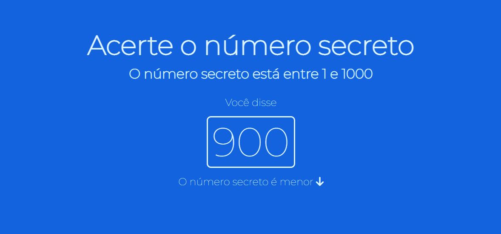
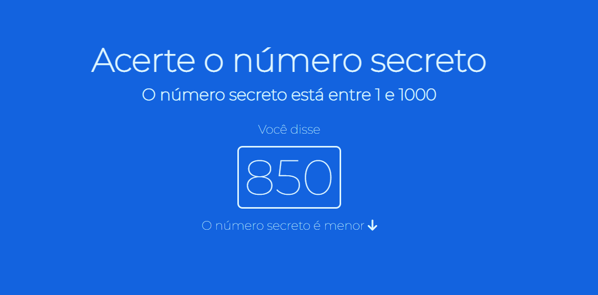
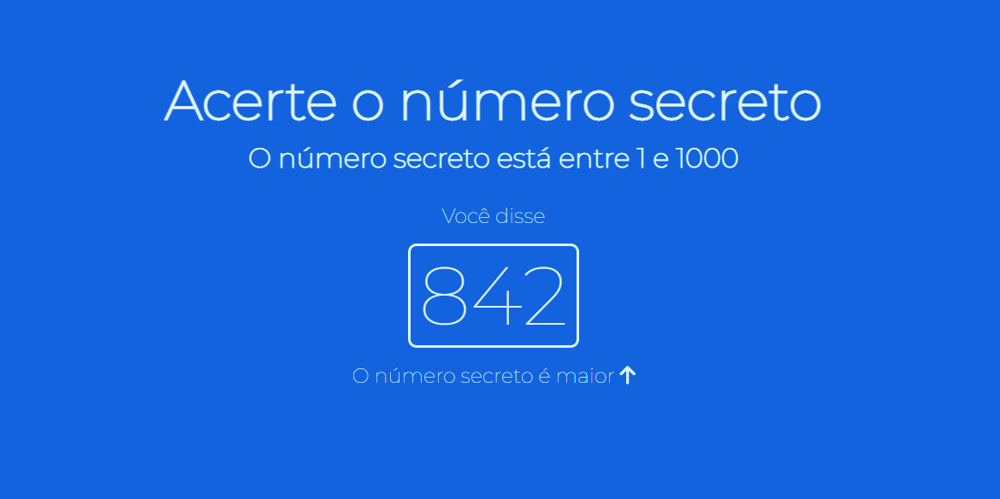
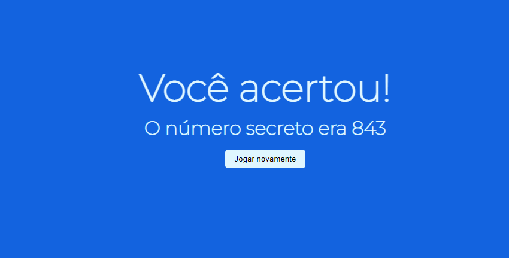
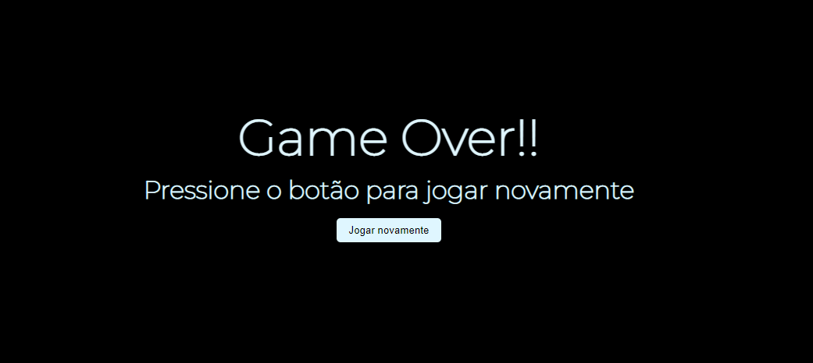

<<<<<<< HEAD
# 
Número Secreto
=======
## 
Número Secreto 
>>>>>>> 3a9f2bf72b2d3b93905d5ec4a4b03934411f3bec

## 
Jogo de adivinhação com reconhecimento de voz

Jogo de adivinhação com reconhecimento de voz, desenvolvido com JavaScript, HTML5 e CSS.

Após abrir a página do jogo, verificar se o microfone está ativo e falar um número de 1 a 1000. Será mostrado na tela se o número falado é menor ou maior que o número secreto, sendo possível chutar o número novamente até acertá-lo.

<<<<<<< HEAD
=======
 
 
<h2>Projeto desenvolvido com Javascript, HTML e CSS</h2>
>>>>>>> 3a9f2bf72b2d3b93905d5ec4a4b03934411f3bec
